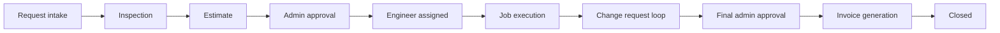

# MESMS — Complete Workflows, Roles & Features

**Project:** Medical Equipment Service Management System (MESMS)  
**Last updated:** 24 July 2026  
**Source:** current frontend routes, backend APIs, Prisma schema, seed data, and `PROJECT_SCOPE_AND_GAP_ANALYSIS.md`

This file is the practical reference for **what the product does**, **who does what**, and **which features exist today**. For deep gap analysis, security risks, and production completion phases, see `PROJECT_SCOPE_AND_GAP_ANALYSIS.md`.

---

## 1. Product overview

MESMS is a multi-tenant, multi-branch platform for medical-equipment service companies. It covers the operational lifecycle from customer/equipment registration through service execution, inventory, AMC, and billing.

| Area | Stack |
|------|--------|
| Staff app | React 18 + Vite + TypeScript — routes under `/app` |
| Customer portal | React — routes under `/portal` |
| Backend | Node.js + Express + Prisma — REST under `/api` |
| Auth | JWT in HTTP-only cookie |
| Database | Prisma (MySQL in current schema) |

---

## 2. End-to-end service workflow

Canonical ticket status flow:

```
new → inspection → estimate → pending_approval → assigned_engineer
  ↔ change_pending_approval → pending_final_approval → pending_invoice → invoiced → closed
```

Admin/Coordinator approve estimates (with engineer assignment). Rejection from `pending_approval` returns the ticket to **estimate** or **inspection** with a required reason logged on the timeline. Customer portal may acknowledge but does not alone unlock jobs.



### Stage-by-stage detail

| # | Stage | Owner | What should happen | Current status |
|---|--------|--------|--------------------|----------------|
| 1 | **Request intake** | Coordinator (or customer) | Create request with customer, equipment, priority, SLA; assign inspector | Staff create works (reference, multi-equipment, SLA, timeline, assign). `assignedInspectorId` stored when an inspector is assigned. Customer self-service missing. |
| 2 | **Inspection** | Inspector | Capture findings, severity, photos, recommended parts; submit report; move to estimate | Findings/recommendation/severity persist; photos stored via `StoredFile`; severity-scaled validation (photos + findings length); spare parts with stock check; auto purchase request on shortfall; advances to `estimate`. Only the assigned inspector (or admin) may start inspection. |
| 3 | **Estimate** | Estimator / Coordinator | Itemized labor + parts; send for admin approval | Aggregate labor/parts totals + line items; sending moves ticket to `pending_approval`. |
| 4 | **Approval** | Admin / Coordinator | Approve (assign engineer) or reject back to estimate/inspection with reason | `POST /api/service-requests/:id/approve-estimate` and `reject-estimate` with timeline logging. Engineer auto-assigned on approval; ticket → `assigned_engineer`. |
| 5 | **Job execution** | Engineer | Start/update progress, evidence, parts use, customer sign-off; submit change requests | Assigned jobs, activities, photos, parts request, sign-off, stock deduction. Change requests move ticket to `change_pending_approval`; admin approve/reject returns to `assigned_engineer`. |
| 6 | **Final approval** | Admin / Coordinator | Review completed work; grant final approval | Job completion → `pending_final_approval`. Admin `final-approval` → `pending_invoice`, auto-generates invoice → `invoiced`. Reject returns to `assigned_engineer` with reason. |
| 7 | **Billing & close** | Billing / Admin | Invoice, payment, administrative close | Invoice from job (service + parts + extras); `POST /api/service-requests/:id/close` moves `invoiced` → `closed`. Payments via billing module can also close ticket. |
| 8 | **Inventory / procurement** | Inventory staff | Reserve parts, POs, fulfill shortages | Stock purchase requests auto-created from inspection part shortfalls; admin/procurement notified. PO convert/receive partially implemented. |

### Supporting workflows

| Workflow | Description | Current status |
|----------|-------------|----------------|
| **AMC lifecycle** | Contract create → renewals → expiry alerts → visits | CRUD + dashboard counts + expiry notifications. No covered-equipment list, visit schedule, or auto renewal. |
| **Stock transfer** | Branch A → dispatch → Branch B receive | Transfer records exist; stock quantity movement on receive not fully implemented. |
| **Purchase order** | Create PO → approve → receive → stock up | PO records exist; line items and receive→stock incomplete. |
| **QR / asset lookup** | Scan or enter asset tag → equipment history | UI + mock data; backend asset-tag lookup exists but page mostly uses mock. |
| **Notifications** | Assignment, low stock, AMC, estimate events | Tenant-wide list/read; not per-user recipient model. |
| **Audit trail** | Log sensitive actions automatically | List/create API + UI; not auto-written by business ops. |
| **Demo seed** | Load sample operational data | Admin settings can trigger demo seeding. |

---

## 3. Roles

### 3.1 System roles (enum)

| Role key | Display name | Primary job |
|----------|--------------|-------------|
| `admin` | Administrator | Full tenant control: users, branches, settings, RBAC, audit, all modules |
| `coordinator` | Service Coordinator | Intake, assign work, schedule jobs, monitor SLA/AMC/ops |
| `inspector` | Inspector | Assigned inspections, findings, submit report |
| `estimator` | Estimator | Build/send estimates; manage revisions |
| `engineer` | Service Engineer | Execute assigned jobs; parts use; evidence; sign-off |
| `inventory` | Inventory Staff | Parts, suppliers, POs, transfers, stock |
| `billing` | Billing Staff | Invoices, revenue views, AMC/finance modules |
| `customer` | Customer | Portal: own equipment, estimates, history |

Custom tenant roles (`Role` + `UserRoleAssignment`) exist in the schema for future flexibility; the JWT/legacy `User.role` enum remains the primary access control used by the app today.

### 3.2 Role responsibilities & access matrix

**Legend:** Full = intended primary access · View = typically read/limited · — = not in default nav

| Module | Admin | Coordinator | Inspector | Estimator | Engineer | Inventory | Billing | Customer |
|--------|:-----:|:-----------:|:---------:|:---------:|:--------:|:---------:|:-------:|:--------:|
| Dashboard | Full | Full | Full | Full | Full | Full | Full | Portal |
| Customers | Full | Full | — | — | — | — | Full | — |
| Equipment | Full | Full | Full | — | Full | Full | — | Own |
| Service Requests | Full | Full | Full | — | Full | — | — | Own* |
| Inspections | Full | Full | Full | — | — | — | — | View* |
| Estimates | Full | Full | — | Full | — | — | Full | Decide* |
| Service Jobs | Full | Full | — | — | Full | — | — | — |
| Projects | Full | Full | — | Full | Full | — | — | — |
| Service Catalog | Full | Full | — | Full | — | — | — | — |
| Inventory | Full | — | — | — | Full | Full | — | — |
| Suppliers | Full | — | — | — | — | Full | — | — |
| Purchase Orders | Full | — | — | — | — | Full | — | — |
| Stock Transfers | Full | — | — | — | — | Full | — | — |
| AMC Contracts | Full | Full | — | — | — | — | Full | — |
| Billing | Full | — | — | — | — | — | Full | View* |
| Expenses & Commissions | Full | — | — | — | — | — | Full | — |
| Reports | Full | Full | — | — | — | — | Full | — |
| Notifications | Full | Full | Full | Full | Full | Full | Full | Portal* |
| QR Tracking | Full | Full | Full | — | Full | Full | — | — |
| Audit Logs | Full | — | — | — | — | — | — | — |
| Branches | Full | — | — | — | — | — | — | — |
| Users | Full | — | — | — | — | — | — | — |
| Office Assets | Full | — | — | — | — | — | — | — |
| Settings | Full | — | — | — | — | — | — | — |

\*Customer portal features marked with `*` are UI-present but largely **mock / not API-backed** today.

### 3.3 Demo login accounts (seed)

| Username | Role | Default password |
|----------|------|------------------|
| `medical_equment` | Admin | `medical@961` |
| `coordinator1` | Coordinator | `demo@123` |
| `inspector1` | Inspector | `demo@123` |
| `estimator1` | Estimator | `demo@123` |
| `engineer1` / `engineer2` | Engineer | `demo@123` |
| `inventory1` | Inventory | `demo@123` |
| `billing1` | Billing | `demo@123` |

*(Rotate these before any shared/staging/production use.)*

### 3.4 Per-role workflow (current vs intended)

#### Administrator
- **Intended:** all modules; tenant settings; users/branches; RBAC matrix; audit; demo data.
- **Current:** admin pages/APIs exist; RBAC matrix controls **sidebar/nav only**; many write APIs lack strict backend role guards.

#### Service Coordinator
- **Intended:** customers/equipment → requests → assign → schedule jobs → monitor AMC/reports.
- **Current:** request create, assign, timeline, workflow advance, job scheduling UI/API exist; business rules incomplete.

#### Inspector
- **Intended:** assigned work only → inspect → submit report with photos and recommended parts → hand off to estimate.
- **Current:** assigned filtering via `assignedInspectorId`; report persistence with photo upload to `StoredFile`; severity-scaled validation; recommended spare parts with stock check and auto purchase request on shortfall; assignment lock on `new → inspection` (403 if not assigned inspector or admin); stage advance to `estimate` on submit.

#### Estimator
- **Intended:** review inspection → itemized estimate → send → revise/approve path.
- **Current:** list/create/update + totals; no line items; no real send; customer approval not server-backed.

#### Service Engineer
- **Intended:** assigned jobs → progress/evidence/parts → signature → complete → service report.
- **Current:** job actions, photos, parts request, stock deduct, name sign-off; PDF/signature capture incomplete; financial field-level hiding not enforced.

#### Inventory Staff
- **Intended:** stock by branch → reserve → PO/receive → transfers → fulfill parts requests → low-stock alerts.
- **Current:** inventory/supplier/PO/transfer CRUD UIs; receiving/reservation/ledger incomplete.

#### Billing Staff
- **Intended:** invoice from job/estimate → tax → send → payments → overdue → revenue reports.
- **Current:** invoice list/create; weak relational links; payments/PDF/reports largely simulated.

#### Customer
- **Intended:** own equipment/requests/estimates/history; create request; approve estimate; download docs.
- **Current:** portal routes exist; **all portal business data from mock**; no customer-scoped APIs for core decisions.

---

## 4. Complete features list (by module)

Status key:

| Tag | Meaning |
|-----|---------|
| **Live** | Persisted via API / DB and usable in staff app |
| **Partial** | UI and/or API exist but incomplete business rules |
| **Simulated** | Toast, mock data, or local state only |
| **Missing** | Specified / expected but not built |

### 4.1 Authentication & access

| Feature | Status |
|---------|--------|
| Login / logout | Live |
| Session restore (`/api/auth/me`) | Live |
| Staff vs customer redirect | Live |
| Password change / reset | Missing |
| MFA / lockout / rate limit | Missing |
| Backend enforcement of RBAC matrix | Missing (nav-only today) |
| Inactive user rejection on every request | Partial / risky |

### 4.2 Tenant, branches, users, settings

| Feature | Status |
|---------|--------|
| Multi-tenant ID on JWT + most queries | Live / Partial |
| Branch CRUD (admin) | Live |
| User management (admin) | Live |
| Company / tax / support settings | Live |
| Editable RBAC module matrix (UI) | Live (frontend nav) |
| Tenant onboarding / provisioning | Missing |
| Automation flags (`lowStockAlerts`, `autoReserveOnApproval`, etc.) | Partial (stored, often unused) |

### 4.3 Customers & equipment

| Feature | Status |
|---------|--------|
| Customer create / list | Live |
| Equipment create / list | Live |
| Branch / customer filters | Live |
| Asset tags / lookup endpoint | Partial |
| Customer/equipment edit-delete in UI | Partial / Missing |
| Ownership validation (equipment ↔ customer) | Partial |
| Warranties / maintenance schedules | Missing |
| Full service history on equipment | Partial / Missing |

### 4.4 Service requests

| Feature | Status |
|---------|--------|
| Create request with reference | Live |
| Multi-equipment selection | Live |
| Priority, SLA, assignment | Live |
| Timeline events | Live |
| Workflow status advance | Partial |
| Kanban / list views | Live / Partial |
| Controlled next-stage only transitions | Missing |
| Cancel / reopen / rollback rules | Missing |
| Customer create request | Missing |
| Attachments / notes / address snapshot | Missing |

### 4.5 Inspections

| Feature | Status |
|---------|--------|
| Assigned inspection list | Live |
| Findings, severity, recommendation | Live |
| Severity-scaled validation (photos + findings length) | Live |
| Submit → move request to estimate | Live |
| Photo capture & storage (`StoredFile`) | Live |
| Recommended spare parts (inventory item + qty) | Live |
| Stock check + auto purchase request on shortfall | Live |
| Procurement status on part lines (`pending_procurement`) | Live |
| Assignment lock (`assignedInspectorId`) | Live |
| Checklist / measurements JSON fields | Partial (schema only) |
| Inspection PDF | Missing |
| Immutable revision history UI | Partial (version bump on admin revise) |

### 4.6 Estimates

| Feature | Status |
|---------|--------|
| Create / list / update / delete API | Live |
| Labor + parts totals | Live |
| Statuses: draft, sent, approved, rejected, revision | Partial |
| Line items (qty, unit price, labor hours) | Missing |
| Tax / discount / terms / validity | Missing |
| Email / PDF send to customer | Missing |
| Customer approve/reject API | Missing (portal mock) |
| Revision history records | Missing |

### 4.7 Service jobs

| Feature | Status |
|---------|--------|
| Schedule / assign engineer | Live |
| Status & progress updates | Live |
| Job activity log | Live |
| Photo evidence (data URL) | Partial |
| Parts request | Partial |
| Stock deduction from job | Partial |
| Customer name sign-off | Live |
| Drawn signature canvas | Missing |
| Service report PDF | Simulated |
| Strict “approved estimate required” | Missing |
| Offline field mode / geo / time entries | Missing |
| Additional-parts supplementary estimate flow | Missing |

### 4.8 Projects & service catalog

| Feature | Status |
|---------|--------|
| Projects module (routes + nav) | Present in app (see `/app/projects`) |
| Project detail | Present in app |
| Service catalog | Present in app |

*(Treat as operational modules in the current UI; verify depth against live APIs when extending.)*

### 4.9 Inventory & supply chain

| Feature | Status |
|---------|--------|
| Inventory item CRUD | Live / Partial |
| Quantity + reserved fields | Live |
| Suppliers CRUD | Live / Partial |
| Purchase orders create/list | Partial |
| Stock transfers create/list | Partial |
| PO / transfer line items | Missing |
| Receive PO → increase stock | Missing |
| Transfer dispatch/receipt stock movement | Missing |
| Auto-reserve on estimate approval | Missing |
| Stock ledger / valuation / serial-batch | Missing |
| Low-stock notifications | Partial |

### 4.10 AMC contracts

| Feature | Status |
|---------|--------|
| AMC CRUD + statuses | Live / Partial |
| Dashboard / expiring counts | Live |
| Expiry notifications | Partial |
| Covered equipment list | Missing |
| Visit schedule / entitlements | Missing |
| Renewal workflow + invoices | Missing |

### 4.11 Billing & finance

| Feature | Status |
|---------|--------|
| Invoice list / create / update / delete | Live / Partial |
| Billing summary | Partial |
| Link invoice to job / customer / estimate | Missing / weak |
| Line items & server-calculated totals | Missing |
| Payments / receipts / credit notes | Missing |
| Invoice PDF / email | Simulated |
| Expenses & commissions module | Present in app |
| Overdue reminders / accounting export | Missing |

### 4.12 Reports, QR, notifications, audit

| Feature | Status |
|---------|--------|
| Dashboard aggregates (staff) | Live / Partial |
| Role-specific dashboards | Missing |
| Reports charts / CSV / PDF export | Simulated |
| Notifications list / mark read | Partial |
| Per-user notification recipients | Missing |
| QR tracking / camera scan UI | Simulated |
| Backend asset-tag lookup | Live (underused by QR page) |
| Printable QR labels | Missing |
| Audit log list UI | Live / Partial |
| Automatic audit on business actions | Missing |
| Tamper-resistant audit | Missing |

### 4.13 Customer portal (`/portal`)

| Feature | Status |
|---------|--------|
| Portal layout & routes | Live (shell) |
| Dashboard | Simulated (mock) |
| Equipment list | Simulated (mock) |
| Estimates approve/reject | Simulated (local state) |
| Service history | Simulated (mock) |
| Document download | Simulated |
| Customer-scoped backend APIs | Missing |

---

## 5. Application map (screens)

### Staff application (`/app`)

| Route | Module |
|-------|--------|
| `/app` | Dashboard |
| `/app/customers` | Customers |
| `/app/equipment` | Equipment |
| `/app/service-requests` | Service Requests |
| `/app/inspections` | Inspections |
| `/app/estimates` | Estimates |
| `/app/jobs` | Service Jobs |
| `/app/projects` | Projects |
| `/app/projects/:id` | Project Detail |
| `/app/service-catalog` | Service Catalog |
| `/app/inventory` | Inventory |
| `/app/suppliers` | Suppliers |
| `/app/purchase-orders` | Purchase Orders |
| `/app/stock-transfers` | Stock Transfers |
| `/app/amc` | AMC Contracts |
| `/app/billing` | Billing |
| `/app/finance-operations` | Expenses & Commissions |
| `/app/reports` | Reports |
| `/app/notifications` | Notifications |
| `/app/qr-tracking` | QR Tracking |
| `/app/audit-logs` | Audit Logs |
| `/app/branches` | Branches |
| `/app/users` | Users |
| `/app/office-assets` | Office Assets |
| `/app/settings` | Settings |

### Customer portal (`/portal`)

| Route | Module |
|-------|--------|
| `/portal` | Portal Dashboard |
| `/portal/equipment` | Portal Equipment |
| `/portal/estimates` | Portal Estimates |
| `/portal/history` | Portal History |

---

## 6. Backend domain coverage

API areas present under `/api` (controller/service/repository pattern):

- Auth, Users, Branches, Settings  
- Customers, Equipment  
- Service Requests, Inspections, Estimates, Jobs  
- Inventory, Suppliers, Purchase Orders, Stock Transfers  
- AMC, Billing, Notifications, Audit Logs, Dashboard  
- Files / documents (as implemented in current code)  
- Domain helpers (roles, catalog-related, etc.)

Prisma models cover tenants, settings, users, roles, branches, customers, equipment, service requests, inspections, estimates, service jobs, job actions, inventory, suppliers, purchase orders, stock transfers, AMC, invoices, notifications, and audit logs.

---

## 7. Current functionality summary

### Working well enough for staff demos
- Login and role-based **navigation**
- Customer & equipment registration (create/list)
- Service request create → assign → timeline
- Inspection report submit → estimate stage
- Estimate create with totals
- Job schedule/assign → progress → activities → basic completion
- Inventory / supplier / PO / transfer **record** management
- AMC contract records
- Invoice create/list
- Admin users, branches, settings, demo seed

### Not production-complete
- Customer portal (mock data)
- Real PDFs, email delivery, QR labels
- Estimate line items & customer decision APIs
- Strict workflow state machine + role transition rules
- Inventory reservation, receiving, ledger, concurrency-safe stock
- Payments and invoice linkage
- Automatic audit + per-user notifications
- Full backend RBAC on every route
- Versioned DB migrations & CI test suite

### One-line verdict

**MESMS has a broad staff-facing UI and many CRUD APIs for the full service lifecycle, but several critical paths (customer approval, documents, inventory movements, payments, and backend authorization) are still partial or simulated.**

---

## 8. Related documents

| File | Purpose |
|------|---------|
| `PROJECT_SCOPE_AND_GAP_ANALYSIS.md` | Full audit: gaps, risks, completion phases, acceptance criteria |
| `frontend/src/config/nav.ts` | Default role → module navigation matrix |
| `backend/prisma/schema.prisma` | Data model and `UserRole` enum |
| `backend/prisma/seed.ts` | Demo tenant, branches, users, sample data |

---

*This file describes the system as implemented in the repository on the update date above. Update it when modules move from Simulated/Partial to Live.*
