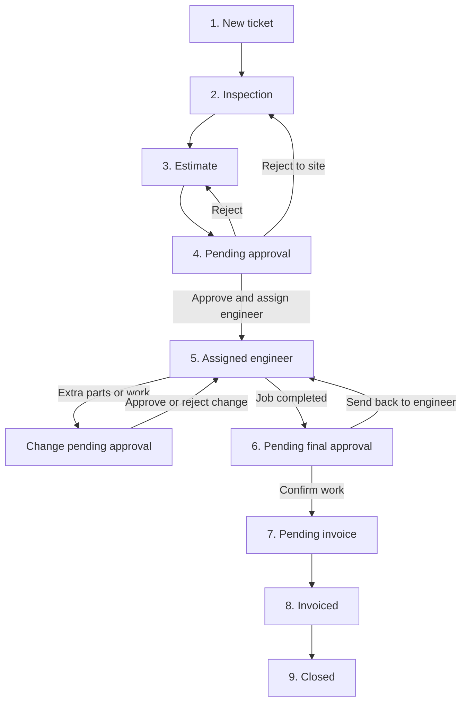

# MEMS Client Handbook

**Medical Equipment Service Management System**  
Complete features list · Workflows · How to use every module

**Audience:** company owners, administrators, and staff  
**Last updated:** 4 September 2026

Use this handbook to train your team. It lists **every feature**, shows **how work moves**, and gives **step-by-step usage** for each screen.

---

## Contents

1. [What this software does](#1-what-this-software-does)
2. [How to start (login & navigation)](#2-how-to-start-login--navigation)
3. [User roles — who does what](#3-user-roles--who-does-what)
4. [Permissions](#4-permissions)
5. [Complete features list](#5-complete-features-list)
6. [Service workflow (ticket → invoice)](#6-service-workflow-ticket--invoice)
7. [Work assignment](#7-work-assignment)
8. [Sales workflow (product sales)](#8-sales-workflow-product-sales)
9. [Inventory & procurement](#9-inventory--procurement)
10. [Billing & finance](#10-billing--finance)
11. [How to use each screen](#11-how-to-use-each-screen)
12. [How to set up users](#12-how-to-set-up-users)
13. [Daily playbooks per role](#13-daily-playbooks-per-role)
14. [Customer portal](#14-customer-portal)
15. [Mobile usage](#15-mobile-usage)
16. [Training accounts](#16-training-accounts)
17. [Glossary](#17-glossary)
18. [Who to call](#18-who-to-call)

---

## 1. What this software does

MEMS runs a medical-equipment service company in one place:

| Business | Purpose |
|----------|---------|
| **Service** | Repair / maintenance tickets: inspect → quote → approve → engineer job → invoice |
| **Sales** | Product / spare-parts counter sales: order → deliver from stock → invoice |
| **Supply chain** | Inventory, suppliers, POs, transfers, returns, ledger |
| **Admin** | Users, settings, auto-assign, RBAC menus, audit, master data |

| Login area | Path | Who |
|------------|------|-----|
| Staff app | `/app` | All staff roles |
| Customer portal | `/portal` | Hospital / clinic contacts only |

---

## 2. How to start (login & navigation)

1. Open the staff login page.
2. Sign in with the username and password from your Administrator.
3. You land on a **role-based dashboard** (numbers and shortcuts match your job).
4. **Desktop:** left menu shows only modules your role may open.  
   **Phone:** bottom tabs show your top screens + Profile.

**Rules**

- Staff → `/app`. Customer portal → `/portal`. Do not mix Customer with staff roles on one login.
- One person can have **several job roles**. All roles grant menu access. The **primary login role** only sets the dashboard layout and the profile label.

---

## 3. User roles — who does what

| Role key | Display name | Responsible for |
|----------|--------------|-----------------|
| `admin` | Administrator | Setup, users, permissions, approvals, audit, full oversight |
| `coordinator` | Service Coordinator | Intake, assignment, SLA, estimate & job approvals |
| `inspector` | Inspection Technician | Site inspection, findings, photos, submit report |
| `estimator` | Estimate Staff | Service quotation from inspection → send for approval |
| `sales` | Sales Staff | Product sales desk, customers, sale invoices |
| `engineer` | Service Engineer | Approved field job, parts, evidence, work report |
| `inventory` | Inventory Manager | Stock, POs, transfers, sale delivery |
| `billing` | Billing Staff | Service invoices, sale invoices, expenses, commissions, reports |
| `customer` | Customer Portal | Own equipment, estimates, history only |

### 3.1 Administrator

- Create / deactivate users; assign one or more roles
- Company name, tax, support email, invoice branding
- Auto-assignment switches and default staff
- Approve / reject estimates and completed jobs
- All modules including Users, Settings, Audit Logs, Office Assets
- Demo seed / remove (training only)

### 3.2 Service Coordinator

- Customers and equipment register
- Create service tickets; assign Inspection Technician at create (Inspection flow)
- Assign / reassign staff later (inspector, estimator, engineer, …)
- Approve estimates and pick engineer; confirm completed work
- Reports and QR tracking  
Does **not** own the product Sales desk.

### 3.3 Inspection Technician

- Assigned inspections on dashboard / Inspections
- Start inspection → findings, severity, recommendation, photos → Submit  
Cannot create tickets, build estimates, or invoice.

### 3.4 Estimate Staff

- Build itemized estimate (labor + parts) from inspection / catalog
- Send for approval; revise if rejected
- Customers and service catalog  
Cannot approve own estimate into a job; cannot raise service invoices.

### 3.5 Sales Staff

- Create customers; record **New sale** (counter)
- Sale invoices and payments (with Billing roles)
- View related tickets for context  
Does not run inspections or warehouse purchasing.

### 3.6 Service Engineer

- Assigned jobs only
- Job progress, work report, photos, stock use
- Request extra products / equipment (change request)
- Submit for coordinator review  
Does not see Sales desk or estimate builder.

### 3.7 Inventory Manager

- Items, quantities, reorder levels
- Purchase orders, returns, transfers, ledger
- Fulfil sale deliveries; handle stock purchase requests
- Engineers may also see inventory / purchase requests for field use

### 3.8 Billing Staff

- Service invoices from completed jobs
- Sale invoices; expenses and commissions; reports  
Does not create tickets or assign field staff.

### 3.9 Customer (portal)

Own organisation only: equipment, estimates, history. No staff menu.

---

## 4. Permissions

Two layers:

1. **Module access (menu)** — Settings → **RBAC — Module Access Matrix** (Administrator).
2. **Action rights** — who may create, assign, approve, bill. These stay with the role even if a menu is shown.

### 4.1 Default module access

| Module | Admin | Coordinator | Inspector | Estimator | Sales | Engineer | Inventory | Billing |
|--------|:-----:|:-----------:|:---------:|:---------:|:-----:|:--------:|:---------:|:-------:|
| Dashboard | ● | ● | ● | ● | ● | ● | ● | ● |
| Sales | ● | | | | ● | | ● | ● |
| Customers | ● | ● | | ● | ● | | | ● |
| Equipment | ● | ● | ● | | | ● | ● | |
| Service Tickets | ● | ● | ● | ● | ● | ● | | |
| Inspections | ● | ● | ● | | | | | |
| Estimates | ● | ● | | ● | | | | ● |
| Service Jobs | ● | ● | | | | ● | | |
| Projects | ● | ● | | ● | | | | |
| Service Catalog | ● | ● | | ● | | | | |
| Inventory Items | ● | | | | | ● | ● | |
| Stock Purchase Requests | ● | | | | | ● | ● | |
| Suppliers … Stock Ledger | ● | | | | | | ● | |
| Billing + Expenses | ● | | | | | | | ● |
| Reports | ● | ● | | | | | | ● |
| Notifications | ● | ● | ● | ● | ● | ● | ● | ● |
| QR Tracking | ● | ● | ● | | | ● | ● | |
| Audit / Users / Office / Settings | ● | | | | | | | |
| Master Data | ● | ● | | | | | | |

### 4.2 Action rights

| Action | Who |
|--------|-----|
| Users, Settings, RBAC, demo seed, audit | Administrator |
| Create customers | Administrator, Coordinator, Estimate Staff, Sales |
| Create / edit equipment | Administrator, Coordinator, Inventory |
| Create tickets, assign, confirm completed work | Administrator, Coordinator |
| Write inspection reports | Administrator, Coordinator, Inspection Technician |
| Build / send estimates | Administrator, Coordinator, Estimate Staff |
| Approve / reject estimates; pick engineer | Administrator, Coordinator |
| Schedule / run jobs; work report | Administrator, Coordinator, Service Engineer |
| Inventory write, POs, transfers, returns, SPR→PO | Administrator, Inventory |
| Force stock adjustment | Administrator only |
| Record product sale | Administrator, Sales |
| Deliver sale (stock out) | Administrator, Inventory, Coordinator |
| Sale invoice / payment | Administrator, Billing, Sales |
| Service invoices | Administrator, Billing |
| Catalog write | Administrator, Coordinator |
| Portal estimate decision | Customer |

Inspectors, estimators, and engineers mainly see **work assigned to them**. Coordinators and Administrators see the full queue.

---

## 5. Complete features list

### 5.1 Service operations

| Feature | What it does |
|---------|----------------|
| Customers | Register hospitals/clinics; open 360° view (equipment, tickets, jobs, estimates, invoices) |
| Equipment | Asset register (tag, model, category, condition, customer, branch); related tickets/jobs; QR history |
| Service Tickets | Kanban: New → Inspection → Estimate → Approval → In Progress → Completed; SLA overdue filter |
| Create ticket | Customer, multi-equipment, type, priority, description; optional **Inspection Technician** only (starts Inspection flow) |
| Ticket detail | Workflow stepper, timeline, Assign / Reassign, assign estimate staff, open estimate, confirm completed work |
| Inspections | Queue + history; report (severity, findings, recommendation, photos); submit → ticket to Estimate |
| Inspection print | Printable report view |
| Estimates | Queue of tickets awaiting quote; builder (labor + parts); draft → send for approval; preview/print |
| Estimate approval | Approve + engineer + schedule, or reject / send back |
| Service Jobs | Board by status; schedule job; work report; photos; deduct stock; request extras; submit for review |
| Projects | Assign lead / staff on a job (staffing view — not a separate multi-ticket project entity) |
| Service Catalog | Standard labor/services used on estimates |
| QR Tracking | Camera or manual lookup of equipment |

### 5.2 Sales desk

| Feature | What it does |
|---------|----------------|
| New sale | Counter sale: customer + inventory / service / other lines → sales order |
| Orders list | Sold items, KPIs, low-stock panel |
| Order detail | Edit lines (until delivered/invoiced); Deliver; create sale invoice; print; record payment |
| Sale reports | Product / spare / service / salesperson / customer / top sellers |

### 5.3 Supply chain

| Feature | What it does |
|---------|----------------|
| Inventory items | SKU, branch qty, reorder, costs; low-stock stats |
| Force stock adjust | Administrator only |
| Stock purchase requests | Shortage requests → Convert to PO |
| Suppliers | Vendor register |
| Purchase orders | Line-item POs; partial receive; return from received qty |
| Purchase returns | Standalone returns |
| Stock transfers | Create → Dispatch → In transit → Receive |
| Stock ledger | Movement history |

### 5.4 Finance

| Feature | What it does |
|---------|----------------|
| Billing board | Queues: Ready → Verification → Draft → Waiting approval → Sent → Partial/Pending payment → Paid → Overdue → Closed |
| Job billing | Build final invoice from completed job |
| Invoice lifecycle | Edit draft → submit → approve → send → payments (partial OK) → PDF/print |
| Expenses & commissions | Record expense; accrue commission |
| Reports | Daily/monthly sales, collected, sale vs service mix, trends |

### 5.5 Administration

| Feature | What it does |
|---------|----------------|
| Users | Multi-role accounts, primary role, active/inactive |
| Settings | Org, logo, tax, invoice branding |
| Automation | Low-stock alerts, auto-reserve, auto service report PDF |
| Auto-assignment | Default inspector / estimator / coordinator / engineer + switches |
| RBAC matrix | Which roles see which menus |
| Master Data | Equipment categories/conditions, customer types, inventory categories |
| Office Assets | Internal company assets (not customer equipment) |
| Audit Logs | Who did what |
| Notifications | In-app alerts; mark read |
| Demo data | Seed / remove (Administrator, training only) |

### 5.6 Customer portal

| Feature | What it does |
|---------|----------------|
| Dashboard | Snapshot for this customer |
| Equipment | Their machines |
| Estimates | Review; acknowledge / request revision / reject (*staff approval still creates the job*) |
| History | Past service |

---

## 6. Service workflow (ticket → invoice)

Nobody skips a stage. Create Request assigns **Inspection Technician only** — not engineer or estimator. Later stages use Assign / Reassign or auto-assign.

```
New → Inspection → Estimate → Pending approval → Assigned engineer
        ↺ change request (extra work)
        → Pending final approval → Pending invoice → Invoiced → Closed
```



### Stage 1 — New ticket (intake)

**Owner:** Coordinator or Administrator

1. Customer exists (Customers → Add if needed).
2. Equipment registered to that customer (Equipment).
3. **Service Tickets → Create Request**.
4. Choose customer, equipment (one or more), type, priority, description.
5. Optionally assign an **Inspection Technician** (or leave blank if auto-assign is on).
6. Create. Ticket reference is created; status = **New**.

### Stage 2 — Inspection

**Owner:** assigned Inspection Technician

1. Open **Inspections** (or the ticket) and start the inspection.
2. Enter severity, findings, recommendation; attach photos.
3. **Submit** the report.

**Automatic**

- Ticket → **Estimate**
- Coordinator notified
- Auto-assign estimator / coordinator if Settings allow

### Stage 3 — Estimate

**Owner:** Estimate Staff (Coordinator can also build)

1. Open **Estimates** or the ticket.
2. Build labor and parts lines (catalog + inventory).
3. Send for approval.  
Status: Estimate → **Pending approval**.

### Stage 4 — Approval

**Owner:** Administrator or Coordinator only

1. Open estimate (or ticket **Review estimate & assign engineer**).
2. **Approve:** pick Service Engineer (+ optional schedule) → job created.
3. **Reject:** reason; send back to Estimate or Inspection.  
Portal customer may acknowledge; **staff approval unlocks the job**.

### Stage 5 — Job

**Owner:** assigned Service Engineer

| Job status | Meaning |
|------------|---------|
| Assigned / Scheduled | Engineer has the job |
| In progress | Work underway |
| Waiting parts | Blocked on stock |
| Customer review / pending review | Waiting sign-off / coordinator |
| Completed | Engineer finished |

On site:

1. Start job; update status; write **work report** (work performed, testing, calibration, recommendation, photos).
2. Deduct stock (or raise shortage / PO path if short).
3. If estimate is not enough → **Request additional products / equipment** (change request) → Coordinator/Admin decide → back to engineer.
4. Submit for review → Coordinator **Approve & Complete** (job) / **Confirm completed work** (ticket).

### Stage 6 — Final approval → Billing

**Owner:** Administrator or Coordinator, then Billing

1. Confirm completed work → ticket ready for invoice.
2. Billing: job billing page → draft invoice → approve → send → record payment.
3. Close ticket when invoicing process is done (as your process requires).

---

## 7. Work assignment

Work appears on a person’s dashboard when it is **assigned** to them (or they created it).

### 7.1 Who can assign

Only **Administrator** and **Service Coordinator**.

| When | What you can assign |
|------|---------------------|
| **Create Request** | Inspection Technician only (optional) |
| **Ticket → Assign / Reassign** | Coordinator, Inspector, Estimator, Engineer, Inventory, Billing |
| **Assign estimate staff** | When ticket is ready to quote |
| **Approve estimate** | Service Engineer (+ schedule) |

### 7.2 Stored assignment fields

| Field | Stage |
|-------|--------|
| Assigned person | Current ticket owner |
| Assigned inspector | Inspection |
| Assigned estimator | Estimate |
| Assigned engineer | Job |

### 7.3 Auto-assignment (Settings)

Administrator → **Settings → Service auto-assignment**. Switch **on** and pick a default person (inactive/missing = no effect).

| Switch | When | Result |
|--------|------|--------|
| Auto-assign inspection technician | New ticket, nobody assigned | Default inspector set |
| Route coordinator after inspection | Inspection submitted | Coordinator notified / may become assignee |
| Auto-assign estimate staff after inspection | Inspection submitted | Estimator becomes assignee; ticket in Estimate |
| Auto-assign engineer on estimate approval | Approved without picking engineer | Default engineer used |

**Recommended:** set defaults for Coordinator, Inspector, Estimator, Engineer; turn on auto-inspector and auto-estimator; leave engineer auto-assign **off** unless one engineer always takes every job.

### 7.4 Where each role finds work

| Role | Where |
|------|--------|
| Inspection Technician | Dashboard, Inspections, mobile Inspect |
| Estimate Staff | Estimates, tickets in Estimate |
| Service Engineer | Service Jobs, mobile Jobs |
| Coordinator | Full ticket/job queues, approvals |
| Inventory | Stock purchase requests, sales to deliver |
| Billing | Billing queues, completed jobs |
| Sales | Sales desk |

---

## 8. Sales workflow (product sales)

Sales is **not** a service ticket. Do not raise a service estimate for a counter sale.

```
Customer → New sale (Sales desk) → Order → Deliver (stock out) → Sale invoice → Payment
```

| Step | Who | What to do |
|------|-----|------------|
| 1 | Sales / Admin | Find or add customer |
| 2 | Sales / Admin | **Sales → New sale** — add lines → create order |
| 3 | Inventory / Admin / Coordinator | Open order → **Deliver** (stock deducted) |
| 4 | Billing / Sales / Admin | Create sale invoice; record payment |

Service estimates stay under **Estimates** and always belong to a ticket.

---

## 9. Inventory & procurement

```
Shortage / SPR → Convert to PO → Receive (partial OK) → Stock available
Optional: Transfer (dispatch → receive) · Purchase return · Ledger · Admin force adjust
```

### How to buy stock

1. Open **Stock Purchase Requests** (or create a **Purchase Order** directly).
2. **Convert to PO:** pick supplier and quantities.
3. On the PO: **Receive items** (partial allowed).
4. If needed: **Return** received quantity to supplier.

### How to transfer between branches

1. **Stock Transfers → New** (from branch, to branch, lines).
2. **Dispatch** when ready → status In transit.
3. Destination **Receive**.

### How stock is used

- Sale **Deliver** deducts stock.
- Engineer deducts stock on the job (shortage can create a purchase path).
- Administrator can **Force stock adjustment** on an inventory item.

---

## 10. Billing & finance

### Service invoice path

```
Job ready → Billing → Open job → Generate draft → (optional) approval
→ Send → Payments (partial OK) → Paid → Closed
```

Billing board tabs help you find work: Ready, Waiting verification, Draft, Waiting approval, Sent, Pending/Partial payment, Paid, Overdue, Closed.

### Expenses & commissions

**Expenses & Commissions** → Record expense or Accrue commission.

### Reports

**Reports** (Admin / Billing / Coordinator): daily and monthly sales, collected amounts, sale vs service mix, trends.

---

## 11. How to use each screen

### Dashboard (`/app`)

- See KPIs and queues for your role.
- Use shortcuts (e.g. create ticket for Admin/Coordinator).
- Check notifications and upcoming jobs.

### Sales (`/app/sales`)

1. Review KPIs and sold items / reports tabs.
2. **New sale** → customer + lines → create.
3. Open an order → edit if still open → **Deliver** → **Create sale invoice** → payment / print.

### Customers (`/app/customers`)

1. Search; filter by type / status.
2. **Add Customer** (name, type, contact, address, status, notes).
3. Open a customer for equipment, tickets, jobs, estimates, invoices; shortcuts to new sale or service estimate.

### Equipment (`/app/equipment`)

1. Search; filter by condition, customer, category.
2. **Add / Edit** (Admin, Coordinator, Inventory).
3. Open detail for specs, related work, QR scan history.

### Service Tickets (`/app/service-tickets`)

1. Use the Kanban columns to track stage.
2. Optional overdue filter via `?filter=overdue` / overdue view.
3. **Create Request** → fill fields → optional Inspection Technician → Create.
4. Open a ticket for timeline, assign, estimate, inspection link, confirm completed work.

### Inspections (`/app/inspections`)

1. **Queue** = work to do; **History** = filed reports.
2. Open a ticket → fill report → photos → **Submit**.
3. Use printable report route when you need a document copy.

### Estimates (`/app/estimates`)

1. Use KPI chips and “tickets awaiting estimate”.
2. Open builder → labor/parts → save draft → send for approval.
3. Detail: approve/reject (Admin/Coordinator), preview/print.

### Service Jobs (`/app/jobs`)

1. Find your job on the board.
2. Update status; write work report; upload photos; deduct stock.
3. Request additional products if needed; submit for review.
4. Coordinator: **Approve & Complete**.

### Projects (`/app/projects`)

1. Open a job from the list.
2. Assign lead / staff for that job.

### Service Catalog (`/app/service-catalog`)

Add/edit standard services (code, name, category, price, active) for estimates.

### Inventory (`/app/inventory`)

1. Search; watch low-stock.
2. **Add item** (Admin/Inventory).
3. Detail: levels; Admin **Force stock adjustment**.

### Stock Purchase Requests (`/app/stock-purchase-requests`)

Open a request → **Convert to PO** (supplier + qty).

### Suppliers (`/app/suppliers`)

Add supplier; view contact; delete if unused.

### Purchase Orders (`/app/purchase-orders`)

New PO with lines → Receive (partial OK) → Return if needed.

### Purchase Returns (`/app/purchase-returns`)

New return → open detail to track.

### Stock Transfers (`/app/stock-transfers`)

New transfer → Dispatch → Receive.

### Stock Ledger (`/app/stock-ledger`)

Search movements by type/reason for audit.

### Billing (`/app/billing`)

1. Pick a queue tab.
2. Open a ready job → build invoice.
3. On invoice: edit → submit → approve → send → pay → PDF.

### Expenses & Commissions (`/app/finance-operations`)

Tabs: Expenses | Commissions → record dialogs.

### Reports (`/app/reports`)

Review revenue and mix charts for management.

### Notifications (`/app/notifications`)

Open alerts; mark one or all read.

### QR Tracking (`/app/qr-tracking`)

Scan with camera or enter code manually → equipment card + history.

### Audit Logs (`/app/audit-logs`)

Admin: search and filter by role.

### Users (`/app/users`)

See [§12](#12-how-to-set-up-users).

### Master Data (`/app/master-data`)

Maintain categories, conditions, customer types, inventory taxonomy used in dropdowns.

### Office Assets (`/app/office-assets`)

Admin: register internal company assets (tag, category, serial, cost, notes).

### Settings (`/app/settings`)

1. Organization, logo, invoice branding, tax.
2. Automation switches.
3. Service auto-assignment defaults.
4. RBAC module matrix.
5. Demo seed / remove (training).

### Profile

Mobile profile; desktop often routes toward Settings / account info.

---

## 12. How to set up users

Path: **Users** (Administrator)

1. **Add user**.
2. Name, username, email, phone, password (min 8 characters).
3. Tick every **job role** this person should perform.
4. If several roles: choose **primary login role** (dashboard only).
5. Leave **Active** on (turn off later to block login without deleting).
6. Save.

| Person | Roles | Primary |
|--------|-------|---------|
| Office manager who quotes | Coordinator + Estimate Staff | Coordinator |
| Tech who inspects and repairs | Inspector + Engineer | Engineer |
| Warehouse + deliveries | Inventory | Inventory |
| Owner | Administrator | Administrator |

**Do not** combine Customer Portal with staff roles. Use a separate portal login for the hospital contact.

---

## 13. Daily playbooks per role

### Administrator — first week

1. Settings: company, address, tax, logo / invoice footer.
2. Users: one account per person.
3. Auto-assign defaults + switches.
4. Master Data + Service Catalog.
5. Opening inventory for common spares.
6. Optional RBAC tweaks.
7. Walk one sample ticket New → Closed with the team.

### Coordinator — every day

1. Dashboard: new tickets, approvals, overdue SLA.
2. Create tickets; assign inspectors at intake.
3. After inspections, keep estimators busy.
4. Approve estimates; pick engineers.
5. Confirm completed jobs for Billing.

### Inspection Technician

1. Inspections / Assigned.
2. Start → findings, photos, recommendation → Submit.
3. QR Scan when you need asset history.

### Estimate Staff

1. Estimates queue.
2. Build from inspection + catalog → Send for approval.
3. Revise if rejected.

### Service Engineer

1. My Jobs.
2. Start → work report / photos / parts.
3. Request extras if needed → Submit for review.

### Inventory Manager

1. Purchase requests + low stock.
2. POs / receive / transfers / ledger.
3. Deliver sales waiting fulfilment.

### Sales Staff

1. Sales → New sale.
2. Follow order until delivered and invoiced.

### Billing Staff

1. Service invoices from ready jobs.
2. Sale invoices and payments.
3. Expenses, commissions, reports.

---

## 14. Customer portal

Path: `/portal`

| Screen | Purpose |
|--------|---------|
| Dashboard | Snapshot |
| Equipment | Their machines |
| Estimates | Acknowledge / revision / reject |
| History | Past service |

Portal users never see other customers. Staff still own ticket creation, estimate **job** approval, and invoicing.

---

## 15. Mobile usage

Phone uses a five-tab bar (role-based) + Profile.

| Role | Typical tabs |
|------|----------------|
| Admin | Home, Jobs, Alerts, Billing, Profile |
| Coordinator | Home, Jobs, Tickets, Alerts, Profile |
| Inspector | Home, Inspect, Scan, Alerts, Profile |
| Estimator | Home, Estimates, Tickets, Alerts, Profile |
| Sales | Home, Sales, Tickets, Alerts, Profile |
| Engineer | Home, Jobs, Scan, Alerts, Profile |
| Inventory | Home, Stock, Scan, Alerts, Profile |
| Billing | Home, Billing, Sales, Alerts, Profile |

Admin/Coordinator may get a floating **Create ticket** action on mobile.

---

## 16. Training accounts

If demo data is seeded, practice with these. **Change or disable before real customer data.**

| Username | Role |
|----------|------|
| `coordinator1` | Service Coordinator |
| `inspector1` | Inspection Technician |
| `estimator1` | Estimate Staff |
| `sales1` | Sales Staff |
| `engineer1` / `engineer2` | Service Engineer |
| `inventory1` | Inventory Manager |
| `billing1` | Billing Staff |

Demo password (seeded): `demo@123`  
Administrator password: from your implementer at install time.

---

## 17. Glossary

| Term | Meaning |
|------|---------|
| Ticket / Service request | One unit of service work, call to close |
| Assignment | Linking ticket/job to a named person |
| Inspection flow | New ticket → Inspection Technician → report → Estimate |
| Estimate | Service quotation for a ticket |
| Job | Field work after estimate approval |
| Change request | Extra products/work after approval |
| SLA | Target due date on the ticket |
| SPR | Stock purchase request |
| Fulfilment | Deliver a sale and deduct stock |
| RBAC | Which roles see which menus |
| Primary role | Dashboard layout when user has several roles |
| Portal | Customer login, not staff app |

---

## 18. Who to call

| Need | Role |
|------|------|
| New login, password, extra role | Administrator |
| Wrong person on a ticket | Service Coordinator |
| Stock not available | Inventory Manager |
| Invoice or payment | Billing Staff |
| Product sale (not repair) | Sales Staff |
| Company tax, auto-assign, menu access | Administrator |

---

*This handbook describes the MEMS staff and portal product as delivered. For internal engineering notes, see other files under `docs/` in the project repository.*
