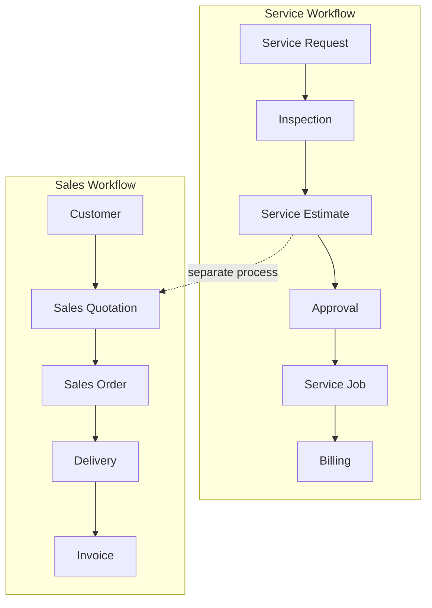

# Sales Module Separation from Estimates — Design & Phased Rollout

**Project:** Medical Equipment Service Management (MEMS)  
**Date:** September 2, 2026  
**Status:** Planning  
**Reference:** Client meeting (September 1, 2026) — Vypar-style Sales Team workflow

---

## 1. Purpose

This document defines how to separate **Sales** (product deals and counter sales) from **Estimates** (service-ticket quotations) in MEMS. The goal is a clear, Vypar-like sales workflow while keeping the service workflow independent.

**Principle:** Estimates handle service quotations tied to tickets. Sales handles product quotations, deals, and fulfilled orders.

---

## 2. Current State

### What exists today

| Area | Implementation |
|------|----------------|
| Sales floor | `/app/sales` — KPIs, recent orders, reports |
| Direct sales | `SalesOrder` model — customer + line items + price, no estimate required |
| Quote → sale | Approved sales quotations (`Estimate` where `serviceRequestId` is null) convert to `SalesOrder` |
| Delivery & invoicing | Stock deduction, invoice creation, commission tracking |
| Quick-add customer | Inline customer creation during sale |
| Sales reports | Daily/monthly, by product, customer, salesperson |

### How separation works today (partial)

| Process | Identifier | Location |
|---------|------------|----------|
| Service estimate | `Estimate.serviceRequestId` is set | Service ticket workflow → `/app/estimates` |
| Sales quotation | `Estimate.serviceRequestId` is null, `requestRef: "SALE"` | Same `Estimate` model |
| Actual sale | `SalesOrder` (optional `estimateId`) | `/app/sales` |

### Gaps

- Sales quotes share the `Estimate` table and UI with service estimates
- Quotation builder lives under `/app/estimates`, not Sales
- No dedicated Sales Team role (uses `estimator` = "Sales / Estimator")
- Customer detail has no sales history tab
- Sales order list capped at 100, no pagination/filters
- No Vypar/Cypar integration

---

## 3. Target Architecture



### Domain boundaries

| Domain | Entity | Scope |
|--------|--------|-------|
| **Estimates** | `Estimate` (ticket-linked only) | Service quotations for repair/maintenance tickets |
| **Sales Quotes** | `SalesQuote` (new) or filtered `Estimate` | Product quotations, no service ticket |
| **Sales Orders** | `SalesOrder` (existing) | Fulfilled commercial transactions |

---

## 4. Phased Rollout

### Phase 1 — Logical separation (low risk, 1–2 weeks)

**Goal:** Clear UX and API boundaries without a new data model.

| Task | Details |
|------|---------|
| Estimates list filter | Add tabs: "Service" / "Sales quotes" on `Estimates.tsx` |
| Service views exclude sales quotes | Service ticket detail, workflow views only show ticket-linked estimates |
| Sales desk owns quote entry | "New quotation" button on Sales floor → `/app/estimates/new?customerId=…` (existing) |
| Customer sales history | Add "Sales orders" tab on `CustomerDetail.tsx` |
| Role label clarity | Rename `estimator` display to "Sales / Estimator" where appropriate (already partial) |
| Navigation | Sales nav group: Sales, Customers, Sales Quotes (filtered estimates) |

**Deliverables:**
- Filtered estimate lists
- Customer sales history tab
- Updated nav labels

**Risk:** Low — no schema changes.

---

### Phase 2 — Sales quotation UX in Sales module (medium, 2–3 weeks)

**Goal:** All pre-sale product work happens under Sales, not Estimates.

| Task | Details |
|------|---------|
| Sales quote list | `/app/sales/quotes` — list sales quotations only |
| Sales quote builder | `/app/sales/quotes/new`, `/app/sales/quotes/:id/build` — move or duplicate estimate builder for `serviceRequestId: null` |
| Estimates module scope | `/app/estimates` shows only ticket-linked estimates |
| Quote conversion flow | "Convert to sales order" stays on quote detail; entry from Sales desk |
| Sales order improvements | Pagination, filters (date, customer, status, salesperson) |
| Cancel/void sales order | `POST /api/sales/orders/:id/cancel` |

**Deliverables:**
- Sales quote CRUD under `/app/sales/quotes`
- Estimates module scoped to service only
- Improved sales order list API

**Risk:** Medium — routing and component duplication/refactor.

---

### Phase 3 — Data model separation (optional, 3–4 weeks)

**Goal:** Dedicated `SalesQuote` entity if product quotations diverge from service estimates.

| Task | Details |
|------|---------|
| New model | `SalesQuote`, `SalesQuoteLine` (or extend `SalesOrder` with `status: draft/quoted`) |
| Migration | Move `Estimate` rows where `serviceRequestId IS NULL` → `SalesQuote` |
| API | `/api/sales/quotes` CRUD, deprecate sales-quote creation via `/api/estimates` |
| Deprecation | Keep read-only access to legacy estimate-based sales quotes during transition |

**When to do Phase 3:**
- Sales quotes need different fields than service estimates (e.g. delivery terms, MOQ)
- Commission rules differ
- Reporting requires clean separation at DB level

**Risk:** High — migration, dual-read period, data integrity.

---

### Phase 4 — Sales Team role & Vypar alignment (future)

**Goal:** Dedicated sales team experience and optional external sync.

| Task | Details |
|------|---------|
| Sales role | New `sales` role with scoped permissions (quotes, orders, customers; no service tickets) |
| Salesperson assignment | Default salesperson on quote/order; commission rules |
| Vypar-style flows | Customer → items → price → save → history (already largely present) |
| Vypar integration | If required: sync customers, items, invoices (greenfield) |

**Risk:** Depends on Vypar integration scope.

---

## 5. Vypar Reference — Feature Mapping

| Vypar capability | MEMS today | Phase 1 | Phase 2+ |
|------------------|------------|---------|----------|
| Customer selection | ✅ Sale form | ✅ | ✅ |
| Customer creation | ✅ Quick-add | ✅ | ✅ |
| Sold item management | ✅ Line items | ✅ | ✅ |
| Sale price | ✅ unitPrice, discount, tax | ✅ | ✅ |
| Sale creation | ✅ Direct sales order | ✅ | ✅ |
| Sales history | ✅ Reports, order list | ✅ Customer tab | ✅ |
| Customer-wise sales | ✅ Reports by customer | ✅ Customer tab | ✅ |
| Quotations | ⚠️ Via Estimates | Filtered list | Sales quotes module |
| Stock on delivery | ✅ Deliver action | ✅ | ✅ |
| Invoicing | ✅ Invoice from order | ✅ | ✅ |

---

## 6. API & Route Summary (Target)

### Estimates (service only)

```
GET  /api/estimates?serviceRequestId=...   # ticket-linked only
POST /api/estimates                        # requires serviceRequestId
GET  /api/estimates/:id
PUT  /api/estimates/:id
```

### Sales (product deals)

```
GET  /api/sales/desk
GET  /api/sales/quotes                     # Phase 2
POST /api/sales/quotes                     # Phase 2
GET  /api/sales/orders
POST /api/sales/orders
POST /api/sales/quotes/:id/convert         # Phase 2 (move from estimates)
POST /api/sales/orders/:id/deliver
POST /api/sales/orders/:id/invoice
GET  /api/sales/reports
```

---

## 7. Acceptance Criteria by Phase

### Phase 1

- [ ] Estimates list has Service / Sales quotes tabs
- [ ] Service ticket detail does not show sales quotes
- [ ] Customer detail shows sales orders for that customer
- [ ] Sales desk "New quotation" is discoverable

### Phase 2

- [ ] Sales quotes created only from Sales module
- [ ] Estimates module shows only service-ticket estimates
- [ ] Sales order list supports pagination and filters
- [ ] Cancel/void sales order supported

### Phase 3 (if undertaken)

- [ ] `SalesQuote` model in use
- [ ] Legacy sales-quote estimates migrated
- [ ] No new sales quotes created via Estimate API

---

## 8. Recommended Order

1. **Phase 1** — Quick wins, no migration
2. **Phase 2** — Sales quote UX consolidation
3. **Defer Phase 3** until product quotations need distinct fields or reporting
4. **Phase 4** — When sales team size or Vypar sync is required

---

## 9. Files to Touch (by phase)

### Phase 1

- `frontend/src/pages/app/Estimates.tsx` — tabs/filter
- `frontend/src/pages/app/CustomerDetail.tsx` — sales orders tab
- `frontend/src/config/nav.ts` — nav labels
- `frontend/src/pages/app/Sales.tsx` — "New quotation" CTA

### Phase 2

- `frontend/src/pages/app/SalesQuotes.tsx` (new)
- `frontend/src/pages/app/SalesQuoteBuilder.tsx` (new or extracted from EstimateBuilder)
- `frontend/src/App.tsx` — routes
- `backend/src/routes/sales.routes.ts` — quote endpoints
- `backend/src/services/sales.service.ts` — quote logic

### Phase 3

- `backend/prisma/schema.prisma` — SalesQuote model
- Migration script for estimate → sales quote
- `backend/src/services/estimates.service.ts` — reject `serviceRequestId: null` on create

---

## 10. Out of Scope (this plan)

- Vypar/Cypar API integration (no references in codebase)
- Service workflow changes (handled separately)
- Inspection report download (separate feature)

---

*Document owner: MEMS development team. Update as phases complete.*
